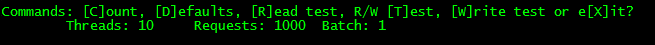

# Priority Queue Console

The console is provided to allow standardized testing of performance for the queue for different topology configurations. The console can be used to model the traffic and load your data will place on a particular configuration and will help validate your partition design. It is able to generate traffic from a client using a number of threads, allowing modeling of concurrent requests. If a single client cannot drive enough traffic any number of clients can be used at the same time from multiple client machines. It is able to generate read, write or read and write traffic for a specified number of requests and batch sizes.

# Using the Console Application

To use the console either start the *QueueServiceConsole.exe* or set the startup project and press **F5**. You see a menu that appears as:

       
The commands correspond to the following actions

| Command | Description |
| --- | --- |
| Count | Counts the number of items a specific queue. You'll be prompted for a queue number, 0 to the number of queues corresponds to a specific queue. -1 is queries all queues, -2 counts the number of leased items, -3 counts the number of expired or dead letter items and -4 counts all of the items regardless of current state. |
| Defaults | Sets the value of the input defaults, threads, requests and batch size. You'll be prompted for each, enter a number or enter to use the current value. |
| Read test | Performs the number of read requests using the specified default values. |
| R/W Test | Performs concurrent read and write tests using the specified default values. |
| Write test | Performs the number of write requests using the specified default values. |
| eXit | Exits the console application |

# Running tests

After running a test, the following output will be generated. This output is from a read test.

The output begins by indicating if this is a read or write test, in this case it's a read test. The next line has the headers described in the table below. The number under the heading indicates the count for that heading.

| Heading | Description |
| --- | --- |
| Total | Total number of requested calls. 1000 in this example output. |
| Successful | Number of successful requests. 0 in this example output. |
| Conflict/Not found | For write test, this indicates conflicts with existing items while in read test this indicates the number of items that were not located. 1009 in this example output. The number of larger than the requested number by the number of threads because there will be a number of threads in flight when the requested number is met. |
| Throttled | Number of requests that were throttled. These requests returned with an HTTP status code of Service Unavailable (503). 0 in this example output. |
| Timeout | Number of requests that timed out. These requests didn't return and generated a HTTP status code of Request Timeout (408). 0 in this example output. |

The next lines show a bucketized output grouped by call times. In this example output the buckets are < 2ms, < 4 ms, < 514ms and > 1s. The value under the heading  is the number of items within that bucket. Higher number buckets do not include counts from the lower buckets. Anything that is greater than 1 second is within the last bucket.

The last line is a summary of useful statistics. 

| Statistic | Description |
| --- | --- |
| RPS | Request per Second. The number of requests divided by the total duration. 1000 for this example output. |
| Mean Duration | The average call duration. 8.00ms in this example output. |
| Median Duration | The call duration for the Nth request, where N is number of requests divided by two. 8.00ms for this example output. 3ms in this example output. |
| Total Duration | Total length of the test in milliseconds. 1158ms in this example output. |

The raw data is appended to a file named *TestOutput.csv* that is located in the same directory as the executable file. This .CSV file can be opened in Excel to view detailed information for the test.

